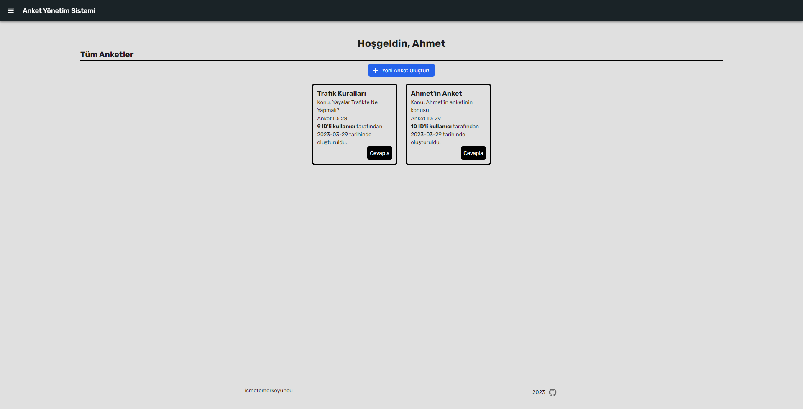

# SurveyApp - Anket Yönetim Sistemi

[Live Version](https://anket-yonetim-sistemi-iomerkoyuncu.netlify.app/)

-

API: https://anket-yonetim-sistemi.onrender.com/

- git clone https://github.com/iomerkoyuncu/anket-yonetim-sistemi
- cd anket-yonetim-sistemi
- npm i
- cd frontend
- npm i
- cd ..
- npm run dev

## Tech Stack:

- Postgres SQL
- Express
- React
- Redux
- Node
- Tailwind CSS
- Material UI
